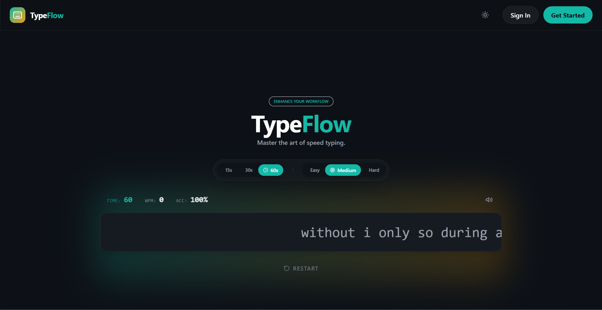

# Typing Speed Booster 🖋️

A web-based typing speed application designed to help you improve your typing skills by practicing with random words. Track your performance, challenge yourself with different difficulty levels, and monitor your progress over time.  

**Try it live:** [https://typing.shwetakohad.in/](https://typing.shwetakohad.in/)  

## Features ✨

- **Random Word Generator:** Get a fresh set of words every time you play.  
- **Difficulty Levels:** Choose from **Easy**, **Medium**, or **Hard**.  
- **Timed Challenges:** Test your typing skills with **15s**, **30s**, or **60s** timers.  
- **Real-Time WPM Tracking:** See your **Words Per Minute (WPM)** as you type.  
- **Accuracy Tracking:** Know how many words were typed **correctly** and **incorrectly**.  
- **Optional Login:** You can play without logging in, but to **save your scores and track your best performance**, login is required.  

## Technologies Used 🛠️

- **Frontend:** React, HTML, TailwindCSS  
- **Backend:** Node.js / Express  
- **Database:** MongoDB  
## Difficulty & Timer Options ⏱️

| Difficulty | Description                     | Timer Options |
|------------|---------------------------------|---------------|
| Easy       | Slower words, beginner-friendly | 15s, 30s, 60s |
| Medium     | Moderate speed and complexity   | 15s, 30s, 60s |
| Hard       | Fast and complex words          | 15s, 30s, 60s |

## How to Use 🖱️

1. **Play Without Logging In:** Start typing immediately to practice your speed.  
2. **Sign Up / Log In (Optional):** Create an account to save your best scores and track your progress.  
3. **Select Difficulty & Timer:** Pick a level and duration for your typing test.  
4. **Start Typing:** Type the displayed words as quickly and accurately as possible.  
5. **View Results:** See your WPM, correct/incorrect words, and your saved best scores (if logged in).  

## Screenshot 🖼️

Here’s how the Typing Speed Booster looks:

  

